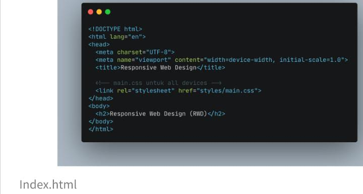

# 1 Agustus 2022
## fetch data
adalah fungsi komunikasi http yang dimana yang bertujuan mengambil dan mengirimkan ke suatu server

## hal yang paling umum digunakan front end fan back end yaitu http reques antara lain :
1. get  = mengambil data
2. post = mingirim data 
3. put = kengirim / meperbaharui / update suatu data 
4. pacth = update ( kekurangannya adalah reques yang tidak begitu aman )
5. delete = menghapus data 

- <i> perlu kita ketahui bahwa pemggunakaan fetch yaitu bisa digunakan  printah put, post dan delete namun secara default dia lebih ke get </i>

- <i> method yang menggunakan body yaitu ( put dan posh) sedangkan method yang tidak menggunakan body yaitu (get dan delete)</i>

sebelum melakukan fetch kita hars memperhatikan di dalam bodi html trdapat printah 

    

ketika printah tersebut di taro maka dapat di panggil kelika melkukan console.log

berikut adalah cara cara mengambil fetch dengan printah method "get", "delete", "post" sebagai berikut:

 contoh cara mmengambil fetch mengguna
kan http request dari alamat ( fetch("https://pokeapi.co/api/v2/pokemon/pikachu/)  dengan menggunakan method  "get"

printahnya sebagai berikut

        fetch("https://pokeapi.co/api/v2/pokemon/pikachu/", {
         method: "GET"
    })
        .then((response) => {
        return response.json();
    })
        .then((data) => {
        console.log(data);
    })
        .catch((error) => {
         console.log(error);
    });

contoh cara mmengambil fetch menggunakan http request dari alamat ( fetch("https://pokeapi.co/api/v2/pokemon/pikachu/)  dengan menggunakan method  "delete"

rintahnya sebagai berikut

    fetch("https://pokeapi.co/api/v2/pokemon/pikachu/", {
         method: "DELETE"
    })
        .then((response) => {
        return response.json();
    })
        .then((data) => {
        console.log(data);
    })
        .catch((error) => {
         console.log(error);
    });

contoh cara mmengambil fetch menggunakan http request dari alamat ( fetch("https://pokeapi.co/api/v2/pokemon/pikachu/)  dengan menggunakan method  "post"

rintahnya sebagai berikut

    fetch("https://pokeapi.co/api/v2/pokemon/pikachu/", {
         method: "post"
    })
        .then((response) => {
        return response.json();
    })
        .then((data) => {
        console.log(data);
    })
        .catch((error) => {
         console.log(error);
    });

# 2 Agustus 2022
## Responsive Web Design
  adalah web yang harus bisa menyesuaikan dengan prangkat yang dapat digunakan yang dalam arti " ketika kita dibuka di hp maka tampilan yang di dekstop akan tetap sama

<i>Tujuanya adalah membuat web kita dapat diakases di dalam device apapun </i>

dalam membuat aplikasi kita harus memikirkan membuat tampilan kepada user yang akan digunakan

## setting up chrome Dev tools
pada chrome kita bisa menggunakan Crome Dev Tools
berikit adalah printahnya dalam mengakses chrome dev tools ( jika sudah membuka chrome kita bisa menggunakan shortcut ini):

## ADD Viewport in html
ketika kita membuat Web kita harus menambahkan meta dalam head contohnya pada gambar dibawah ini gambar tersebut menyatakan responsive

## User Max WIdth Elemen 
tampilan yang tidak menggunakan max width 

jika kita menggunakan max width maka masukan printahnya di dalam body html seperti perintah dibawah ini :

    

    maka tampilanya seperti gambar dibawah ini 

## Media Query
 adalah Responsive Web Design yang sangat menyenangkan dan mudah jika kita menggunakan media Query

 berikut jenis jenis media query
 - untuk mengatur web hanya menggunakan 2 jenis media queri
 - keduanya yaitu min-width dan max-width
 contohnya seperti berikut:

        @media screen and (max-width : 100px){

         }

         @media screen and (min-width : 100px){

         }
media query digunakan untuk membuat style tergantung pada jenis device. contoh tampilan device seperti pada gambar dibawah ini:

2 cara dalam menggunakan media Query antara lain :

1. membuat File css beberapa bentuk dari masing - masing device. contoh printahnya seperti dibawah ini

2. menggabungkan 1 file css untuk styling sebagai device.contoh printahnya seperti dibawah ini

## Break Point
adalah perubahan yang terjadi pada tampilsn saat berganti device atau width disebut break point

### Complex Break Point Media Query
jika kita menginginkan tampilan yang ingin di terapkan pada range, tampilan yang diinginkan ditetapkan pada range ukuran trtentu.

### Important Notes
tidak ada aturan baku besaran width dan banyak breakpoint yang harus dilakukan 

responsive web design dilakukan sesuai dengan kebutuhan konten kita jika konten yang ditampilkan sudah tidak bisa diakses atau sulit dilihat pada width tertentu sudah saatnya kita menggunakn media query

# 3 Agustus 2022
## bootstrap 5
Bootstrap adalah kerangka kerja front-end yang kuat yang digunakan untuk membuat situs web dan aplikasi web modern 

2 cara menggunakan boostrap  yaitu 
1. panggilan css dan js online 
2. panggilan css dan js ofline (download)

> panggilan css dan js online 

- memanggil css online perintahnya di dalam head

        <link rel="stylesheet" href="https://cdn.jsdelivr.net/npm/bootstrap@5.2.0/dist/css/bootstrap.min.css"/>

- memanggil js online perintahnya didalam body

        

link di atas adalah menggunakan contoh link pokemon 

> panggilan css dan js ofline (download)

- memanggil css ofline perintahnya didalam head

        <link rel="stylesheet" href="vendor/bootstrap-5.0.2-dist/css/bootstrap.min.css">

- memanggil js ofline perintahnya didalam body

        

